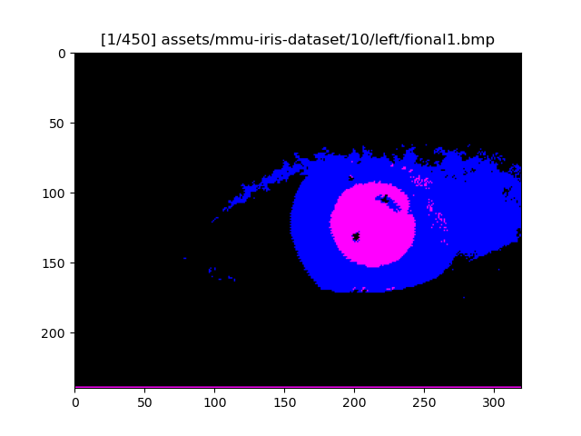
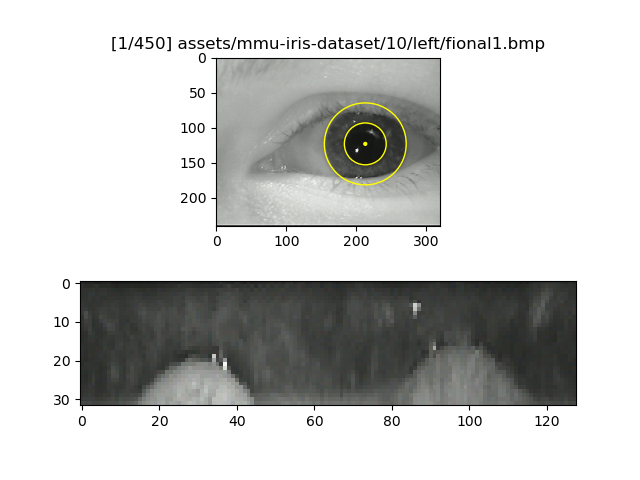
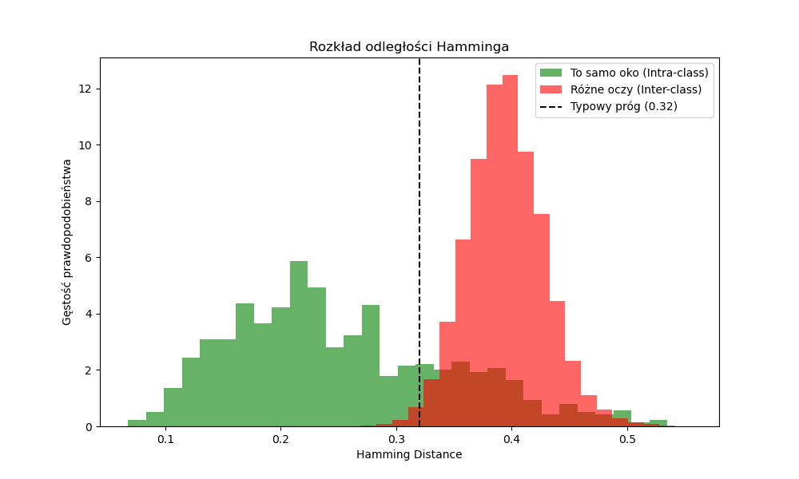

Interactive showcase of processing stages:
```bash
python src/main.py assets/*/*/*.bmp
# or wherever your images are
```




| key | action |
| -- | -- |
| `Right` / `Left` | [next / previous] image |
| `Shift+Right` / `Shift+Left` | jump 10 images [forward / backward] |
| `Space` / `Ctrl+Space` | [next / previous] processing stage |

---

To visualize iris similarity:

```bash
# Populate `output/` with iris codes.
python src/cmp/gen.py assets/*/*/*.bmp

# Read `output/` and visualize Hamming distances.
python src/cmp/cmp.py
```


